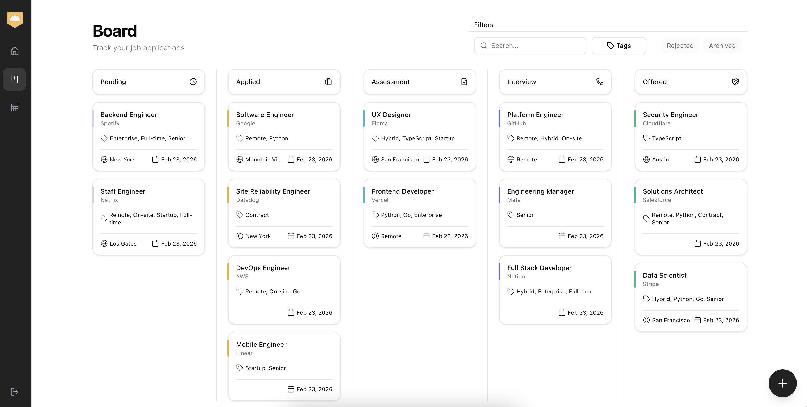
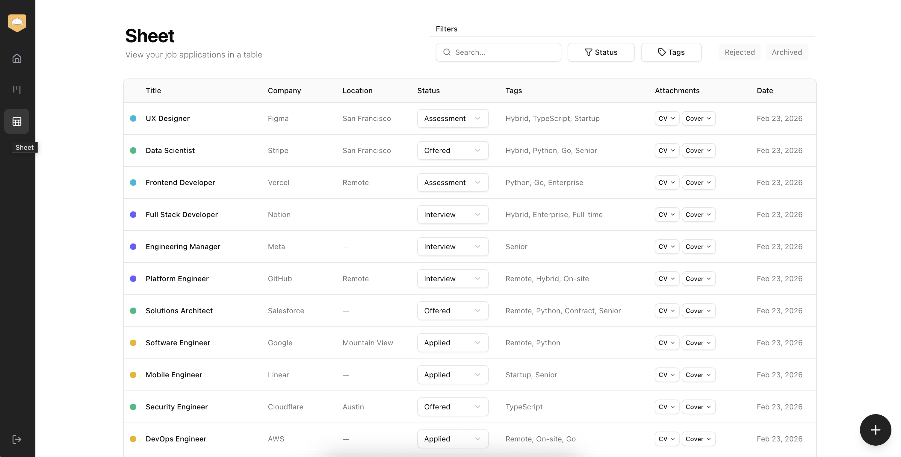
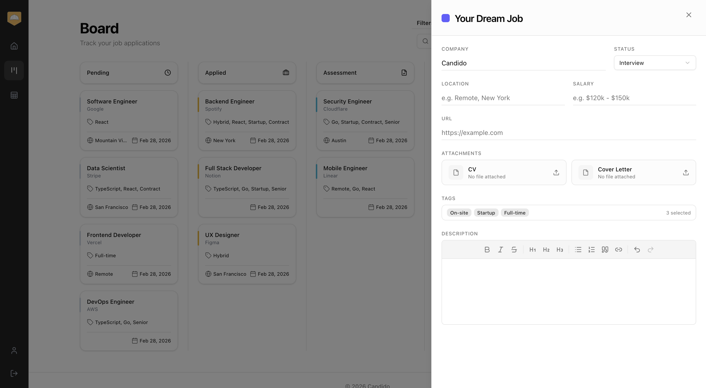

<hr />

Candido is a job application tracker that helps you manage your job search. Add roles you're interested in, move them through stages as you progress, and keep everything organized in one place.

Try it live at [candidohq.com](https://candidohq.com)

### Board

Track your applications at a glance with a drag-and-drop board. Move roles through each stage—from applied to offer—as things progress.



### Sheet

View all your applications in one table. Sort, filter, and search by company or status, and use tags to keep everything in order.



### Manage applications

Add applications easily and upload the description, your CV and cover letter. All the details you need, in one place.



<hr />

A full-stack app with a Next.js client and an Express API server, run via Docker Compose.

## Prerequisites

- [Docker](https://docs.docker.com/get-docker/) and Docker Compose

## Running the stack

From the project root:

```bash
./run stack
```

This builds and starts the full stack in **development mode** with hot reload:

| Service | URL |
|---------|-----|
| **Client** (Next.js) | [http://localhost:3000](http://localhost:3000) |
| **Server** (Express API) | [http://localhost:8000](http://localhost:8000) |
| **Database** (PostgreSQL) | localhost:5432 |
| **Prisma Studio** | [http://localhost:5555](http://localhost:5555) |

Stop the stack with `Ctrl+C`.

## Other commands

```bash
./run client <command>           # Run a command in the client container (e.g. ./run client npm run build)
./run server <command>           # Run a command in the server container (e.g. ./run server npm start)
./run server:prisma <command>    # Run Prisma CLI (e.g. ./run server:prisma migrate dev)
./run server:prisma:studio       # Start Prisma Studio at http://localhost:5555
```
