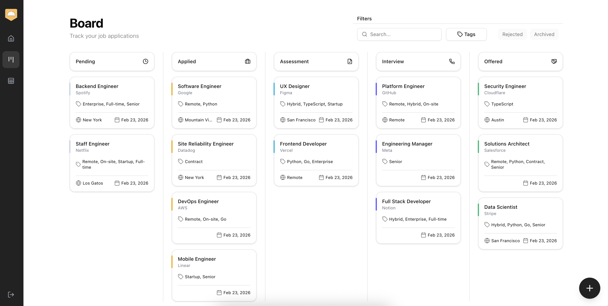
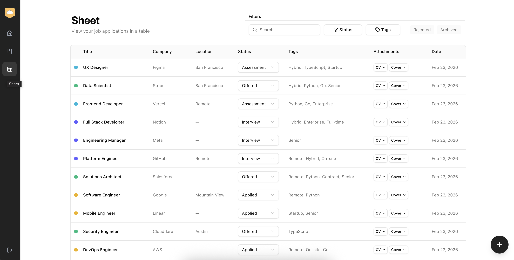
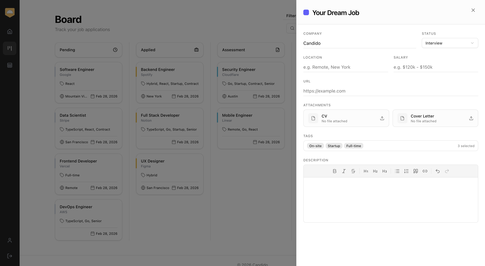

<hr />

Candido is a job application tracker that helps you manage your job search. Add roles you're interested in, move them through stages as you progress, and keep everything organized in one place.

Try it live at [candidohq.com](https://candidohq.com)

### Board

Track your applications at a glance with a drag-and-drop board. Move roles through each stage—from applied to offer—as things progress.



### Sheet

View all your applications in one table. Sort, filter, and search by company or status, and use tags to keep everything in order.



### Manage applications

Add applications easily and upload the description, your CV and cover letter. All the details you need, in one place.



<hr />

A full-stack app with a Next.js client and a Rails API, run via Docker Compose.

## Prerequisites

- [Docker](https://docs.docker.com/get-docker/) and Docker Compose

## Running the stack

From the project root:

```bash
./run stack
```

This builds and starts the stack in **development mode** with hot reload:

| Service | URL |
|---------|-----|
| **Client** (Next.js) | [http://localhost:3000](http://localhost:3000) |
| **API** (Rails) | [http://localhost:8000](http://localhost:8000) |
| **Database** (PostgreSQL) | localhost:5432 |

The client calls `http://localhost:8000/api/v1`. On first boot Rails runs `db:migrate`, which renames the original Prisma tables in place. Do not run `db:prepare` or `db:schema:load` against a database that already has data.

Stop the stack with `Ctrl+C`, or `./run stop` if it is detached.

## Other commands

```bash
./run rspec                    # Rails request/model specs
./run rails <command>         # e.g. ./run rails console
./run bundle:install          # bundle install in the backend container
./run lint                    # RuboCop + ESLint
./run client <command>        # e.g. ./run client npm run build
```

## Production

Live deploys client + Rails via `docker-compose.prod.yml` and **Deploy to Production**. The API image is `ghcr.io/<owner>/candido-backend`. Boot runs `db:migrate` (rename the live tables in place). Do not run `db:prepare` or `db:schema:load` on production.

The Next.js API origin is baked in at image build (`NEXT_PUBLIC_API_URL`). Keep that secret equal to the public API URL the browser already uses. The client calls `{NEXT_PUBLIC_API_URL}/api/v1`.

## Applying this cutover

This is not a no-op deploy. Client and API must go out together, and Postgres is renamed in place on boot.

1. Merge to `main` and wait for CI.
2. Confirm a Postgres backup (snapshot or `pg_dump`).
3. Run **Deploy to Production** (release or workflow_dispatch). Expect a few minutes of downtime.
4. The new Rails image runs `db:migrate` before Puma starts, then serves `/api/v1`.
5. Smoke: open candidohq.com, log in, move a card, upload a PDF.

If migrate fails the API container will not stay up. Fix and redeploy; do not run `db:prepare`.

Required GitHub secrets:

| Secret | Notes |
|--------|--------|
| `EC2_HOST`, `EC2_SSH_KEY`, `EC2_APP_PATH` | Existing deploy target |
| `NEXT_PUBLIC_API_URL` | Live API origin, baked into the client image |
| `CORS_ORIGIN` | Live site origin, e.g. `https://candidohq.com` |
| `SECRET_KEY_BASE` | Rails only. Generate with `./run rails secret` |
| `DATABASE_URL` | Live Postgres URL (existing schema) |
| `AWS_BUCKET_NAME`, `AWS_REGION`, `AWS_ACCESS_KEY_ID`, `AWS_SECRET_ACCESS_KEY` | Existing uploads bucket |
| `BREVO_SMTP_LOGIN`, `BREVO_SMTP_KEY` | Verification / feedback email |

An optional second instance can still use **Deploy Rails (test instance)** (`EC2_RAILS_HOST`, `EC2_RAILS_APP_PATH`, `NEXT_PUBLIC_RAILS_API_URL`).
